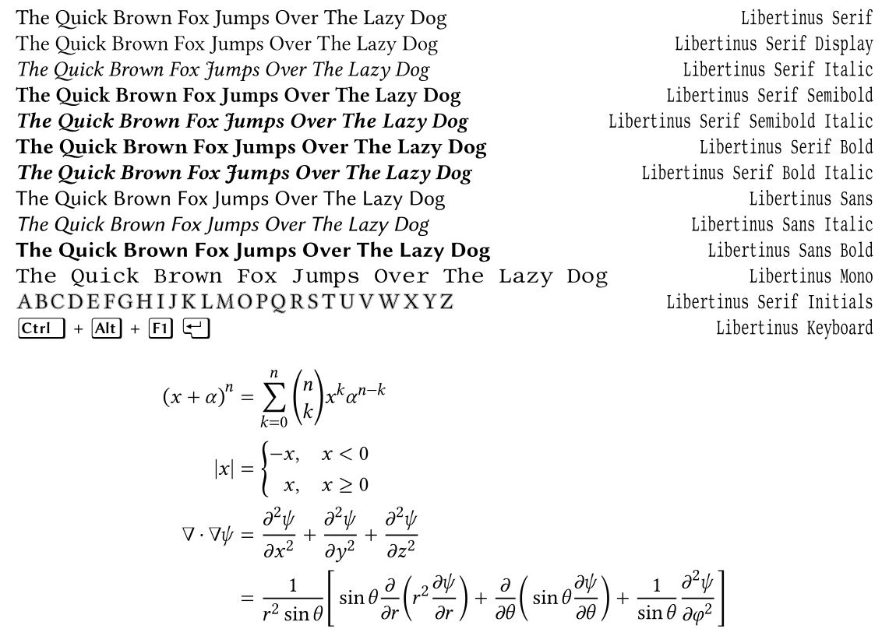

# Libertinus Font Family

The family consists of:

* Libertinus Serif: forked from *Linux Libertine*.
* Libertinus Sans: forked from *Linux Biolinum*.
* Libertinus Mono: forked from *Linux Libertine Mono*.
* Libertinus Math: an OpenType math font for use in OpenType math-capable applications (like LuaTeX, XeTeX, or MS Word 2007+).

## Download

A zip file containing the font files can be downloaded from the “[Releases][3]” page of the project on GitHub.

## Contributing

See the [`CONTRIBUTING.md`](CONTRIBUTING.md) file for instructions on how to build the fonts and contribute any changes.

## History

The Libertinus fonts project began as a fork of the [Linux Libertine][1] and Linux Biolinum fonts.
The original impetus was to add an OpenType math companion to the Libertine font family.
Over time it grew into to a full-fledged fork addressing many of the bugs in the Libertine fonts.

Libertinus was forked from the [5.3.0 (2012-07-02) release][2] of Linux Libertine fonts.
Thanks to Frédéric Wang for coming up with the name Libertinus.

Thanks Khaled Hosny who was the primary contributor and maintainer from 2012–2020.
If you like this font consider sponsoring him.

In 2020, Khaled passed the role of maintainer on to Caleb Maclennan.

## License

All fonts in the Libertinus family are available under the terms of the Open Font License, version 1.1.
See the included [OFL.txt](OFL.txt) for details.

[1]: https://en.wikipedia.org/wiki/Linux_Libertine
[2]: https://sourceforge.net/projects/linuxlibertine/files/linuxlibertine/
[3]: https://github.com/alerque/libertinus/releases
